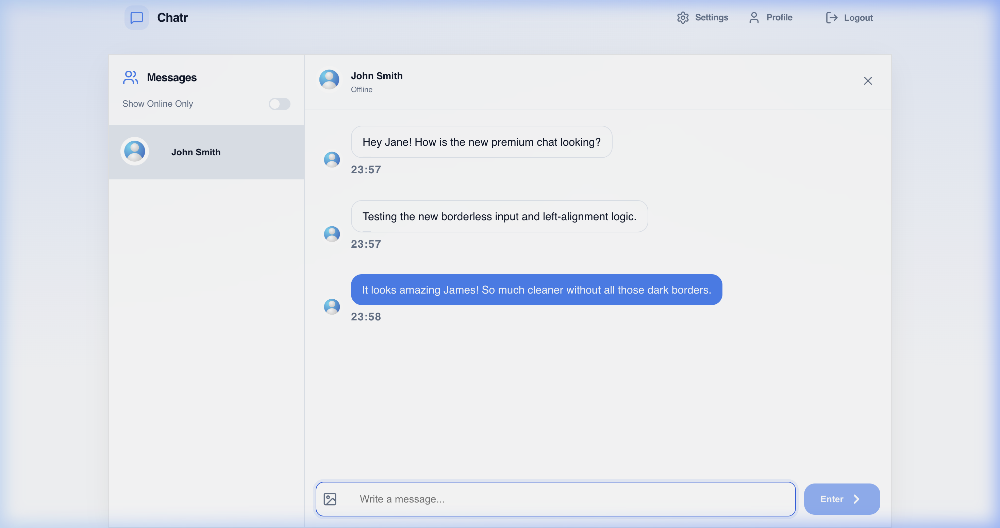
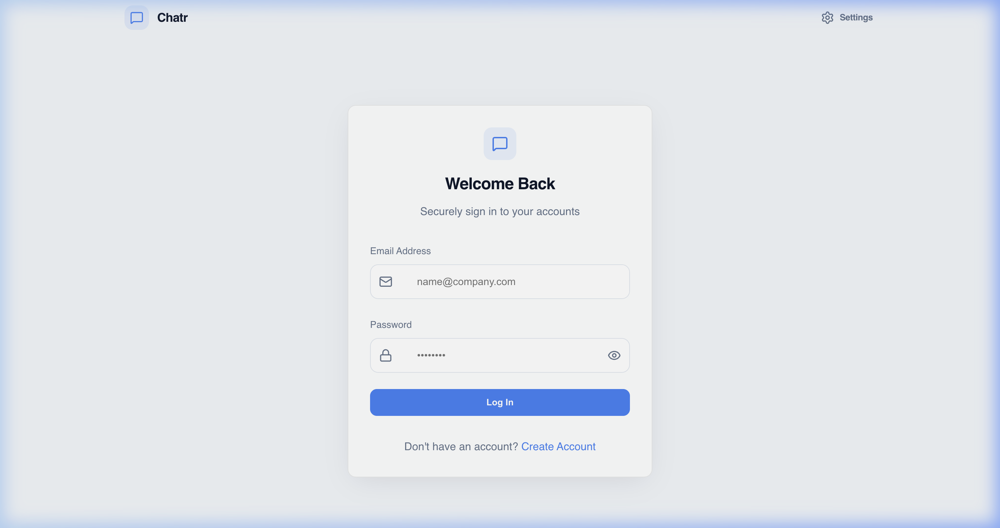

# Chatr: Premium AWS-Native Messaging Experience

Chatr is a professional-grade, borderless messaging application built with a scalable AWS-native architecture and a premium Light Theme aesthetic. It focuses on high performance, rigorous security, and a seamless user experience.



---

## ✨ Key Features

- **Premium UI/UX**: Minimalist, borderless light-theme design with high-contrast shadows, sticky selection states, and fluid micro-animations.
- **AWS-Native Architecture**: Fully migrated from legacy DBs to **DynamoDB** (Data), **S3** (Storage), and **SES** (Identity/Email).
- **Hardened Security**:
    - **Helmet & Rate Limiting**: Global protection against XSS and DoS attacks.
    - **Strict Validation**: All API inputs are rigorously checked with **Zod Schemas**.
    - **Identity Protection**: JWT-based authentication with secure `httpOnly` cookies.
- **Real-time Messaging**: Hybrid WebSocket support using **Socket.io** (Local) and **AWS API Gateway WebSockets** (Production).
- **Pro-Active Monitoring**: Native `/health` orchestration endpoint and startup environment validation.

---

## 🏗️ Architecture Detail

Chatr follows a clean **Repository Pattern** to ensure service logic is decoupled from cloud infrastructure:
- **Compute**: Node.js / Express
- **Persistence**: Amazon DynamoDB
- **Blob Storage**: Amazon S3
- **Dev-Ops**: LocalStack (for local development) & Terraform (for production infrastructure).

---

## 🚀 How to Run (Local Development)

### Prerequisites
- [Docker & Docker Compose](https://www.docker.com/products/docker-desktop/)
- Node.js v18+ (optional, for local linting)

### 1. Snapshot the Environment
Create your `.env` file in the `backend` directory:
```env
PORT=3000
NODE_ENV=development
JWT_SECRET=your_super_secret_key
AWS_REGION=us-east-1
CLIENT_URL=https://chatr.local
```

### 2. Launch with Docker Compose
The fastest way to get started is using the pre-configured Docker stack:
```bash
docker-compose up --build
```
This command spins up:
- **LocalStack**: Emulating S3, DynamoDB, and API Gateway.
- **Backend**: Hardened Node.js server.
- **Frontend**: Vite-powered React application.
- **Nginx Proxy**: Mapping services to `chatr.local` and `api.chatr.local`.

### 3. Verification
- **App**: Access [https://chatr.local](https://chatr.local)
- **API Health**: [https://api.chatr.local/health](https://api.chatr.local/health)

---

## 📸 Screenshots

| Login Experience | Messaging Input |
| :---: | :---: |
|  |  |

---

## 🛠️ Tech Stack

**Frontend**: React, Vite, Lucide Icons, Zustand (State), Axios.
**Backend**: Node.js, Express, Zod (Validation), Helmet, Bcrypt, Socket.io.
**Infra**: Docker, LocalStack, Terraform, Nginx.

---

## 📜 Development Status

✅ **Production Ready**: The core architecture and security hardening are complete. Next phases include advanced AI moderation and CI/CD automation.